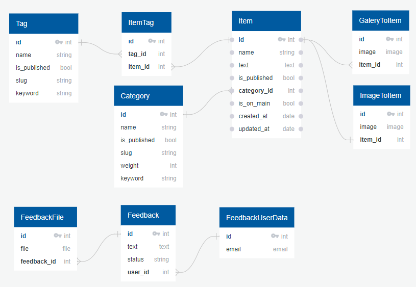

# django_intensive_lessons
[](https://github.com/fivan999/django_intensive_lessons/actions/workflows/python-package.yml)
[](https://github.com/fivan999/django_intensive_lessons/actions/workflows/django.yml)
## Установка и запуск

### Клонировать репозиторий
```
git clone https://github.com/fivan999/django_intensive_lessons
```
### Установка зависимостей
Создайте виртуальное окружение и активируйте его
```
python -m venv venv
venv\Scripts\activate
```

Установите нужные зависимости

Для запуска
```
pip install -r requirements/base.txt
```
Для разработки
```
pip install -r requirements/dev.txt
```
Для тестов
```
pip install -r requirements/test.txt
```
### Запуск
Создайте .env файл в папке shop.<br>

В нем нужно указать значения:<br>
- SECRET_KEY (ваш секретный ключ, по умолчанию - default)<br>
- DEBUG (включать ли режим дебага, по умолчанию - True)<br>
- ALLOWED_HOSTS (если включен DEBUG, он ['*'], иначе по умолчанию - 127.0.0.1)<br>
- INTERNAL_IPS (для debug_toolbar, по умолчанию - 127.0.0.1) <br>
- REVERSE_RUSSIAN_WORDS (нужен ли переворот русских слов при каждом 10м GET запросе, по умолчанию - false)<br>
- EMAIL (с какой почты вы будете отправлять письмо пользователю)
- USER_IS_ACTIVE (активный ли пользователь сразу после регистрации)
<br>
Пример .env файла - .env.example

Запустите проект:
```
python shop/manage.py runserver
```
## Схема базы данных

